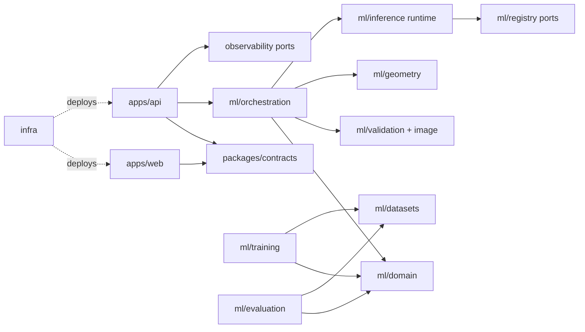

# Arquitetura do Repositório

## Decisão

Propor um monorepo polyglot modular, com web TypeScript, API Python fina, contratos language-neutral e um pacote Python de ML dividido por módulos. O monorepo é direção do KAN-6; esta arquitetura permanece `Proposed` até aprovação de KAN-28 e ADR-0001.

## Justificativa

Contratos, fixtures e mudanças verticais precisam ser revisados atomicamente, enquanto datasets, pesos e deploys continuam externos. Um monorepo simplifica CI e rastreabilidade sem permitir imports entre fronteiras indevidas.

## Alternativas

- Multi-repo por web/API/ML: melhor isolamento operacional, mas alto custo de sincronização no MVP.
- Monólito Python com frontend embutido: conflita com TypeScript estrito e separação de experiência.
- Microserviços: rejeitados antes de necessidade de escala/deploy independente.

## Regras obrigatórias

### Fronteiras

- **Frontend:** apresenta estados e coleta entrada; conhece contrato público/capabilities, nunca framework, checkpoint, tensor, preprocessing ou fornecedor do modelo.
- **API:** autenticação futura, upload, limites, lifecycle, HTTP e composition root; não contém domínio nem importa treino/avaliação/datasets.
- **Domínio:** resultados, erros, unidades, value objects e ports; não depende de FastAPI, framework web, storage, registry ou GPU.
- **Contratos:** schemas públicos/versionados e golden files; sem implementação de negócio.
- **Validação/imagem:** MIME, orientação, EXIF, qualidade e transformações determinísticas; sem HTTP/storage concreto.
- **Geometria:** marcador, pose, escala/plano e incerteza; recebe arrays/tipos controlados.
- **Orquestração:** coordena etapas/fallbacks; depende de ports e domínio, não de adapters concretos.
- **Runtime de inferência:** carrega artefato validado e executa preprocessing/modelo/calibração; nunca treina.
- **Treinamento:** experimentos/checkpoints; pode usar contratos/core controlados, nunca é importado por API/runtime.
- **Avaliação:** métricas e test set congelado; não promove modelo diretamente.
- **Datasets:** adapters, manifests e splits; dados reais ficam em storage externo.
- **Storage/registry:** ports no core e adapters nas bordas; artefatos por URI opaca, versão e checksum.
- **Observabilidade:** interfaces/eventos sem payload sensível; sink concreto é adapter.
- **Infraestrutura:** define deploy/configuração; código de aplicação não importa `infra`.

Integração externa usa port/adaptor e fake local. Lógica de domínio é testável offline. Recurso opcional declara capability, timeout, erro e fallback; fallback muda o resultado/warnings de forma visível.

### Configuração e ambientes

- `.env.example` contém nomes, descrição e valores não secretos. `.env*` reais são ignorados.
- Startup valida schema completo e falha com erro tipado; não há fallback silencioso inseguro.
- Ambientes: `local`, `test`, `preview`, `staging` e `production`. Código é o mesmo; configuração/artefato variam.
- Variáveis públicas são allowlisted para o bundle; todo o resto é secret/config server-side.
- Configurações de modelo, taxonomia, preprocessing, thresholds e flags têm versão/checksum.
- Defaults seguros: sem retenção, sem serviço pago, sem GPU/rede implícita e capability opcional desligada.
- Feature flag tem owner, default, escopo, telemetria e remoção. Secret manager/cloud dependem de KAN-83/KAN-97.

### Evolução

Começar modular dentro do monorepo. Extrair pacote/serviço somente por necessidade comprovada de deploy, escala, segurança ou ownership independente, com ADR, contrato e migração. Arquitetura tests bloqueiam ciclos/imports; exceção tem ticket e validade.

## Regras recomendadas

- Composition roots em `apps/*`; dependências apontam para dentro.
- Ports próximos do consumidor, adapters nas bordas.
- Caches e otimizações depois de benchmark.
- Diagramas C4/sequência atualizados em mudanças de fronteira.

## Exemplos

- API chama `AnalyzeUseCase`; o adapter FastAPI futuro apenas traduz HTTP.
- MoGe indisponível produz fallback `rgb_only` e warning contratual, não silêncio.
- Modelo/peso fica em registry externo com checksum, nunca no Git.

## Anti-patterns

- Web importando nome de checkpoint; API importando `ml.training`; domínio importando FastAPI.
- SDK de storage espalhado em módulos; download em import; dataset/peso no Git.
- Duplicar preprocessing em treino e inferência sem contrato/ equivalência.

## Checklist

- [ ] Dependência segue diagrama e não forma ciclo.
- [ ] Domínio/framework, API/treino e web/modelo estão separados.
- [ ] External I/O via adapter e testável offline.
- [ ] Contratos/configs/artefatos versionados.
- [ ] Dados/pesos fora do Git; fallback visível.
- [ ] Mudança de fronteira tem ADR e arquitetura tests.

## Riscos

Monorepo pode virar monólito acoplado; import rules e ownership mitigam. Código compartilhado demais entre treino/runtime pode contaminar dependências; compartilhar apenas contratos/core determinístico.

## Pontos pendentes

- Framework web, HTTP, ML, storage, registry, observabilidade e deploy.
- KAN-28/KAN-31 devem aprovar fronteiras e threat model; KAN-30 sequência; KAN-95/KAN-97 adapters e operação.

